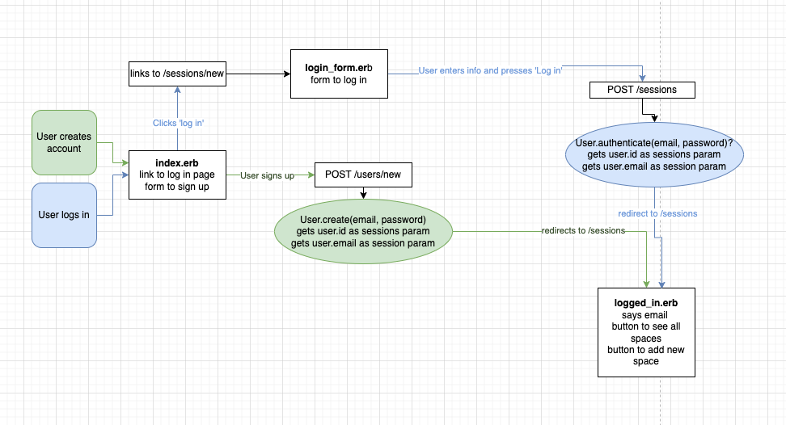
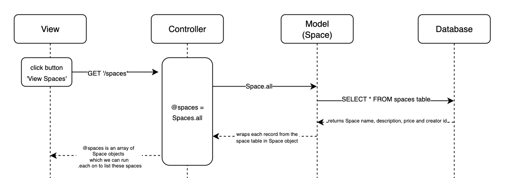
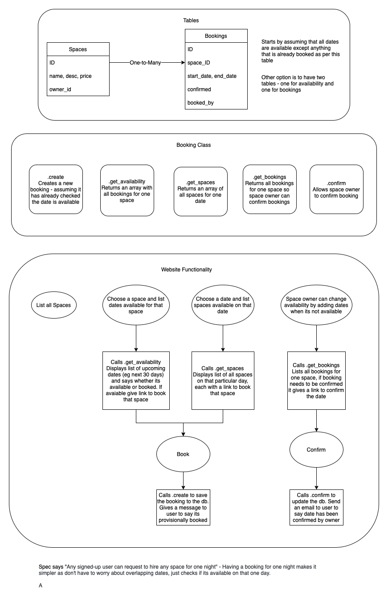
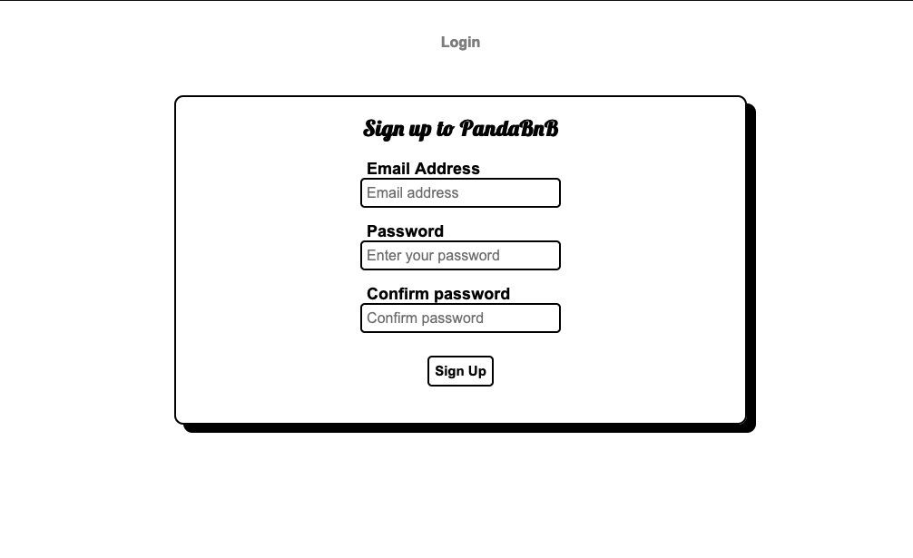
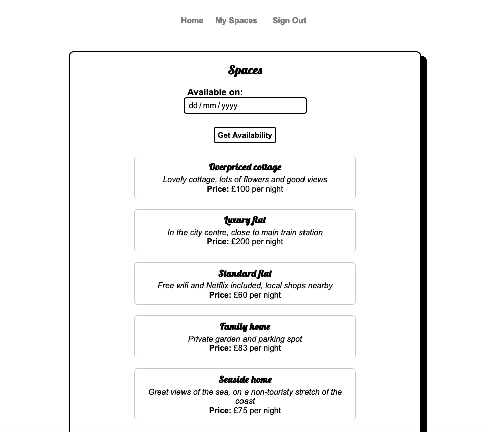

```
    ____                  __         ____        __    
   / __ \____ _____  ____/ /___ _   / __ )____  / /_   
  / /_/ / __ `/ __ \/ __  / __ `/  / __  / __ \/ __ \
 / ____/ /_/ / / / / /_/ / /_/ /  / /_/ / / / / /_/ /
/_/    \__,_/_/ /_/\__,_/\__,_/  /_____/_/ /_/_.___/ 
                                                                                             
```
**PandaBnb** was made in collaboration as part of our training with Makers. It is built so a user can create an account, list various properties ("spaces"), view all listed spaces and manage their listings.

## Set-up 
This project was developed using `Ruby 3.1.0` and the following dependencies: 
* BCrypt
* Capybara
* PG
* Puma
* Rspec
* Sinatra
* WEBrick


### To set up the database
Connect to `psql` and create the `makersbnb` database:
```
CREATE DATABASE makersbnb;
```
To set up appropriate tables, connect to the databse in `psql` and run the SQL scripts in the 'db/migrations' folder in the given order.

To set up the **test environment**, repeat the above steps with the database name `makersbnb_test` instead.

## Testing
Our tests are created using RSpec and Capybara using a test database which will automatically empty after every test. 
To run the tests for this project enter `rspec` into the command line.

## :panda_face: User Stories :panda_face:

### User Story One :white_check_mark:
```
As a user
So that I can use MakersBnB
I'd like to be able to sign up
```
**Diagram for user story one:**


The following shows the user pathing for creating an account vs logging in to an existing account - demonstrating how both paths end up at the same page in the end. When a user creates a new account they are automatically logged in after that.


### User Story Two :white_check_mark:
```
As a user
So that I can rent a space
I'd like to view all spaces
```
**Diagram for this user story**


### User Story Three :white_check_mark:
```
As a user
So that I can rent out my spaces
I'd like to be able to list a new space
```

### User Story Four :white_check_mark:
```
As a user
So that I can give more information on a space
I'd like to give my spaces a name, description and price
```

## Booking Tool
For the next user stories we used the following diagram to plan how this functionality would work:


### User Story Five :white_check_mark:
```
As a user
So that I can see when a space is available
I'd like to filter by avaliable dates
```

### User Story Six :white_check_mark:
```
As a user
So that I can hire a space
I'd like to be able to book a space for a day
```

### User Story Seven :white_check_mark:
```
As a user
So that I can manage my spaces
I'd like to be able to confirm or deny a booking request
```

## User View

### Home Screen
Which lets the user either create an account or navigate to the log in page



### All Spaces
Which shows all of the spaces listed on PandaBnB with the ability to filter results based off avaliability. Users have the ability to click on a space to be redirected to a new page which gives more information and allows the user to select a date to book.
Users can also use the menu to navigate to view their spaces which they've previously listed.



